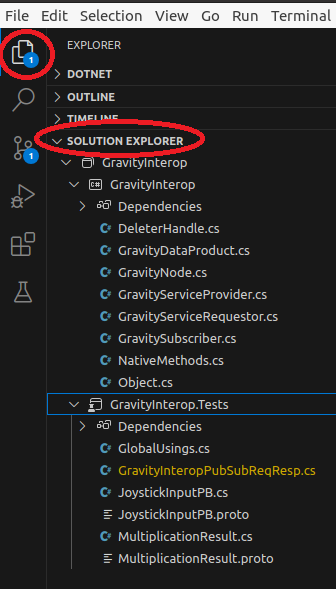
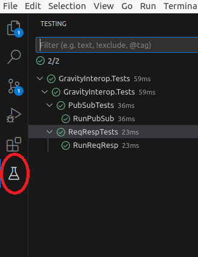

### Gravity C#

This is a cross-platform interop layer between Gravity and C# managed code to (so-far) allow you to publish/subscribe and (async) request/response.  It consists of a native cpp plugin and a corresponding small C# library which uses [P/Invoke](https://learn.microsoft.com/en-us/dotnet/standard/native-interop/pinvoke) to access the Gravity API.  

See the [Unit tests](GravityInterop.Tests/GravityInteropPubSubReqResp.cs) for the examples of the functionality

To get started: 
1. build gravity using the cmake build, for example on Linux:
   - ```$ cd gravity/build```
   - ```$ cmake -DGRAVITY_USE_EXTERNAL_PROTOBUF=FALSE -DZMQ_HOME=/usr/local/lib -DCMAKE_BUILD_TYPE=release -DCMAKE_INSTALL_PREFIX=`pwd`/install -DSKIP_JAVA=ON -DSKIP_PYTHON=ON ..```
   - ```$ cmake --build . --config release```
2. build the native plugin
   - ```$ cd gravity/src/api/DotNet/gravity_plugin/build```
    - ```$ cmake -DGRAVITY_ROOT=/home/user/git/gravity/build/install -DCMAKE_BUILD_TYPE=release```
    - ```$ cmake --build . --config release --target install```
3. Install .NET (for instance on [Ubuntu](https://learn.microsoft.com/en-us/dotnet/core/install/linux-ubuntu))
4. Set your library path to load the plugin (PATH on Windows and LD_LIBRARY_PATH on Linux), for example:
- ```$ export LD_LIBRARY_PATH=/home/user/git/gravity/build/install/lib:/home/user/git/gravity/build/install/deps/spdlog/lib:/home/user/git/gravity/src/api/DotNet/gravity_plugin/build/install/Plugins```
5. Make sure to run the ServiceDirectory and then you can Open [GravityInterop.sln](GravityInterop.sln) with VS Code and the [C# Dev Kit](https://marketplace.visualstudio.com/items?itemName=ms-dotnettools.csdevkit) Extension
- ```$ cd gravity/src/api/DotNet && code .```

-  


